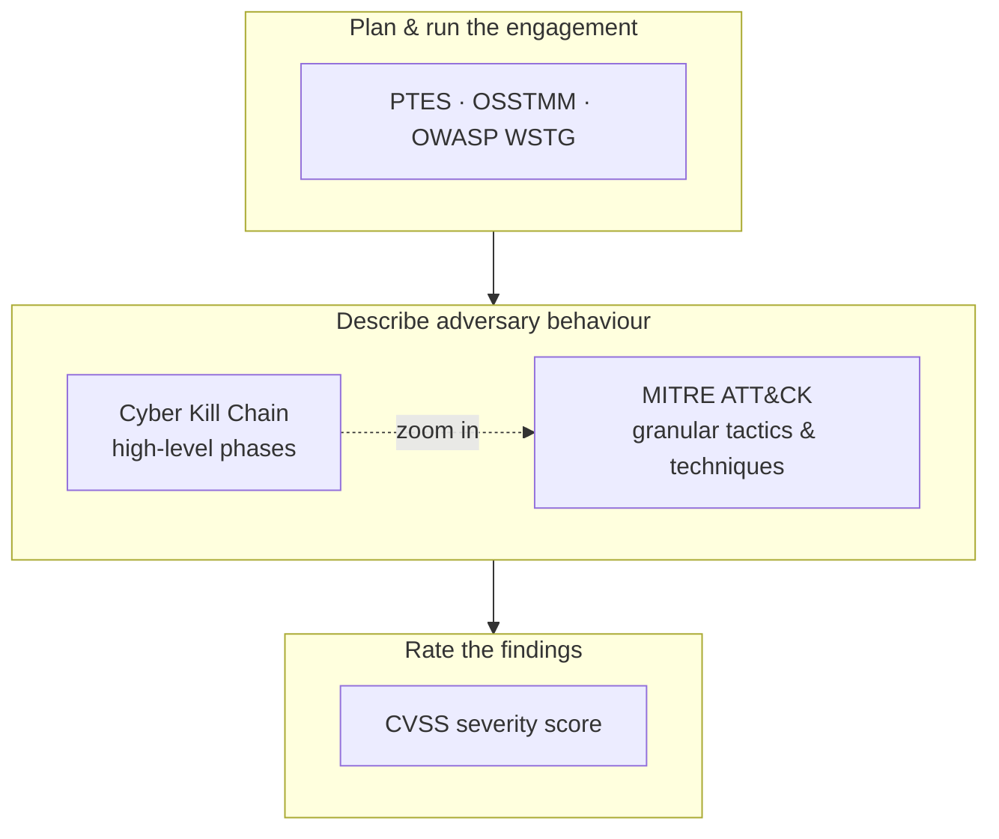

# Methodology

## Up
- [[Hacking]]

The frameworks and methodologies that give offensive and defensive security **structure** — how to plan an engagement, describe adversary behaviour, and score what you find. Tools tell you *how*; methodology tells you *what to do, in what order, and how to communicate it*.

## Subtopics
- [[Cyber Kill Chain]] — Lockheed Martin's 7-stage model of an intrusion
- [[MITRE ATT&CK]] — knowledge base of adversary tactics & techniques
- [[PTES]] — Penetration Testing Execution Standard (engagement lifecycle)
- [[OSSTMM]] — Open Source Security Testing Methodology Manual (metrics-driven)
- [[CVSS]] — Common Vulnerability Scoring System (severity scoring)

---

## Where Each One Fits

- **Process frameworks** (PTES, OSSTMM, OWASP WSTG) — *how to conduct* a test end to end.
- **Adversary models** (Kill Chain, ATT&CK, Diamond Model) — *how to describe* what an attacker does; used by red teams to plan and blue teams to detect.
- **Scoring** (CVSS) — *how to rate* the severity of each finding for the report.

---

## Quick Comparison

| Framework | Type | Best for |
|---|---|---|
| **[[Cyber Kill Chain]]** | Adversary lifecycle (7 stages) | Big-picture narrative of an intrusion; disruption points |
| **[[MITRE ATT&CK]]** | Behaviour knowledge base (14 tactics, 100s techniques) | Detection engineering, red-team planning, threat intel mapping |
| **[[PTES]]** | Engagement process (7 phases) | Structuring a pentest from scoping to reporting |
| **[[OSSTMM]]** | Metrics-based test methodology | Repeatable, measurable operational-security testing |
| **[[CVSS]]** | Vulnerability scoring | Prioritising/communicating finding severity |

---

## Other Models Worth Knowing

- **Unified Kill Chain** — merges Kill Chain + ATT&CK into 18 phases (in/through/out).
- **Diamond Model** — analyses intrusions across *adversary, capability, infrastructure, victim*.
- **OWASP WSTG / MASTG** — web and mobile testing guides (pairs with the [[Web]] notes).
- **NIST SP 800-115** — technical guide to security testing & assessment.
- **MITRE D3FEND** — the defensive counterpart to ATT&CK (countermeasures).
- **Pyramid of Pain** — ranks indicator types by how much they cost the adversary when denied.

---

## How These Connect to the Rest of the Vault

- [[OSINT]] + [[Reconnaissance]] ≈ Kill Chain *Reconnaissance* / ATT&CK *Reconnaissance & Discovery*.
- [[Password Cracking]] ≈ ATT&CK *Credential Access*.
- [[Web]] (PortSwigger/OWASP) findings get scored with **[[CVSS]]** and mapped to **[[MITRE ATT&CK]]** techniques in reports.
