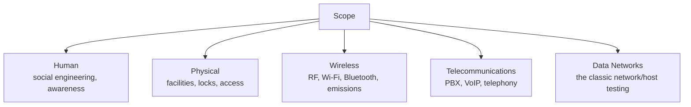
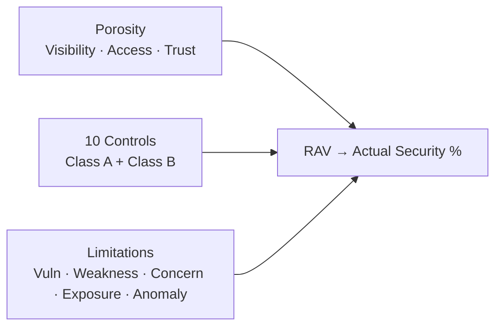

# OSSTMM

## Up
- [[Methodology]]

The **Open Source Security Testing Methodology Manual (OSSTMM)**, maintained by **ISECOM**, is a peer-reviewed methodology for **measurable, repeatable** security testing. Where [[PTES]] gives a lifecycle, OSSTMM's distinguishing idea is **metrics**: it turns a security test into quantified, verifiable numbers (the RAV) rather than subjective opinion. Its scope is *operational security* — what's actually true right now, tested empirically ("trust but verify, then verify again").

---

## Core Idea: Test the Facts, Then Measure Them

- Security claims must be **verified operationally**, not assumed from policy/config.
- Results are expressed as repeatable **metrics** so two testers get comparable numbers.
- Focus on **operational security** = the real, present interaction between assets and threats.

---

## The Five Channels

OSSTMM organises testing by **channel** — the medium through which interactions (and attacks) occur:

| Channel | Covers |
|---|---|
| **Human** | People — social engineering, security awareness |
| **Physical** | Tangible security — doors, locks, guards, physical access |
| **Wireless (Spectrum)** | All electromagnetic comms — Wi-Fi, Bluetooth, RFID, emissions |
| **Telecommunications** | Phone systems — PBX, VoIP, voicemail |
| **Data Networks** | Computer networks & hosts (the "usual" pentest surface) |

This breadth (people + physical + RF + telecom + data) is wider than most network-only methodologies.

---

## RAV — the Risk Assessment Values

The heart of OSSTMM's measurability. The **RAV** produces a single, comparable **Actual Security** score from three dimensions:

| Dimension | Meaning |
|---|---|
| **Operational Security (OpSec / Porosity)** | The attack surface — the *holes*: Visibility, Access, Trust |
| **Controls** | Protective measures, in two classes: **Class A** (interactive: Authentication, Indemnification, Resilience, Subjugation, Continuity) and **Class B** (process: Non-repudiation, Confidentiality, Privacy, Integrity, Alarm) |
| **Limitations** | The known weaknesses: Vulnerability, Weakness, Concern, Exposure, Anomaly |

RAV logic: more porosity **lowers** security; effective controls **raise** it; limitations (flaws in those controls) **lower** it again. The output is a percentage you can track over time and compare across systems.

---

## Related Concepts

- **STAR** (Security Test Audit Report) — OSSTMM's standardised report/attestation of the tested state and its RAV.
- **Trust metrics** — OSSTMM formalises *trust* as something measurable (why you trust an interaction), not just a feeling.
- **Rules of Engagement** — like [[PTES]], it defines proper conduct/scoping for a lawful, ethical test.

---

## OSSTMM vs PTES

| | OSSTMM | [[PTES]] |
|---|---|---|
| Emphasis | **Measurement & repeatability** (RAV metrics) | End-to-end **process/lifecycle** |
| Scope | 5 channels (human→physical→RF→telecom→data) | Primarily network/app/social pentest |
| Output | Quantified Actual Security % (STAR report) | Narrative findings + remediation report |
| Feel | Rigorous, scientific, metrics-heavy | Practical, workflow-oriented |

They're complementary: run the engagement with a PTES-style flow and use OSSTMM's rigour/metrics where you need **comparable, auditable numbers**.

---

## Takeaways

- OSSTMM's signature contribution is **turning security testing into metrics** (the RAV → Actual Security %).
- It thinks in **channels**, forcing coverage beyond just data networks (people, physical, wireless, telecom).
- Use it when stakeholders need **repeatable, comparable, auditable** measurements over time; use [[PTES]]/OWASP WSTG when you need a practical workflow/checklist.
