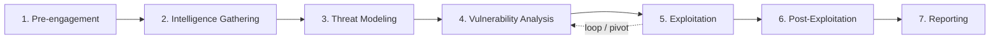

# PTES

## Up
- [[Methodology]]

The **Penetration Testing Execution Standard (PTES)** defines a **7-phase lifecycle** for running a penetration test end to end — from scoping and legal sign-off through exploitation to the final report. It answers "how do I actually *run* an engagement?", where [[MITRE ATT&CK]] and the [[Cyber Kill Chain]] describe adversary behaviour.

---

## The 7 Phases

| # | Phase | What happens |
|---|---|---|
| 1 | **Pre-engagement Interactions** | Scope, rules of engagement (RoE), goals, timelines, **written authorization**, emergency contacts, legal/NDA |
| 2 | **Intelligence Gathering** | OSINT + active recon; map the target's people, assets, tech ([[OSINT]], [[Reconnaissance]]) |
| 3 | **Threat Modeling** | Identify likely threats/attack paths; prioritise high-value assets & realistic adversaries |
| 4 | **Vulnerability Analysis** | Find & validate weaknesses (scanning, manual testing, chaining) |
| 5 | **Exploitation** | Safely prove impact by exploiting validated vulns to gain access |
| 6 | **Post-Exploitation** | Assess real business impact: privesc, pivoting, data access, persistence, then clean up |
| 7 | **Reporting** | Communicate findings, risk ([[CVSS]]), and remediation to technical + exec audiences |

---

## Phase 1 — Pre-engagement (the phase people skip and regret)

The **most important** phase — it keeps the test legal, safe, and useful.

- **Scope**: in-scope IPs/domains/apps, explicitly **out-of-scope** systems, test windows.
- **Rules of Engagement**: allowed techniques (DoS? social engineering? physical?), data-handling rules, off-limits actions.
- **Authorization**: signed "get-out-of-jail" letter from someone with authority. Without it, the activity may be illegal.
- **Logistics**: test type (black/grey/white box), on/off-hours, points of contact, escalation path if something breaks.

---

## Phase 7 — Reporting (the deliverable that matters)

A test is only as valuable as its report. Typical structure:

- **Executive summary** — business-level risk, no jargon.
- **Methodology & scope** — what was tested and how.
- **Findings** — each with description, evidence/PoC, affected assets, **[[CVSS]] score**, and prioritised **remediation**.
- **Strategic recommendations** — root causes and systemic fixes.
- Optional: map findings to **[[MITRE ATT&CK]]** and note detection gaps.

---

## Test Types (set in Pre-engagement)

| Type | Tester knowledge | Simulates |
|---|---|---|
| **Black box** | None | External attacker with no inside info |
| **Grey box** | Partial (creds/docs) | Malicious user / limited insider |
| **White box** | Full (source, architecture) | Thorough audit, max coverage |

---

## PTES vs Other Process Frameworks

| Framework | Focus |
|---|---|
| **PTES** | Full pentest lifecycle, broad (net/app/social) |
| **[[OSSTMM]]** | Metrics-driven, repeatable operational-security measurement |
| **OWASP WSTG** | Deep web-app testing checklist (pairs with [[Web]]) |
| **NIST SP 800-115** | Government technical assessment guide |
| **PTES Technical Guidelines** | Companion doc with concrete tools/commands per phase |

---

## Takeaways

- The order matters: **authorize → gather intel → model threats → find → exploit → assess impact → report.**
- Phases 4–6 **loop** — post-exploitation discoveries feed new vuln analysis and further exploitation.
- Pre-engagement and Reporting are where engagements succeed or fail; the middle is the "fun" part but the ends deliver the value.
- Use PTES as the *process* skeleton and hang [[MITRE ATT&CK]] techniques + [[CVSS]] scores on it.
