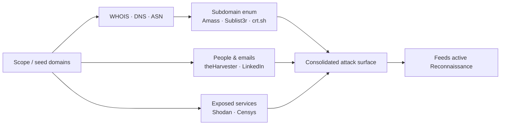

# OSINT

## Up
- [[Hacking]]

**Open-Source INTelligence** — gathering information about an organization's people, technologies, and exposed assets from **publicly available and third-party sources**, without directly touching the target. It's the quiet, low-risk first phase of an assessment that builds the picture before any active scanning (see the sibling **[[Reconnaissance]]** category).

> **Scope & ethics:** searching public data is generally low-risk, but *acting on* what you find (connecting to exposed hosts, accessing leaked data) must stay inside an authorized scope. Handle any discovered PII responsibly. Educational reference.

## Subtopics
- [[Amass]] — attack-surface mapping & subdomain enumeration (OWASP)
- [[Sublist3r]] — quick passive subdomain enumeration
- [[theHarvester]] — emails, names, subdomains & hosts from public sources
- [[Shodan]] — search engine for internet-connected devices/services
- [[recon-ng]] — modular web-recon / OSINT framework
- [[Google Dorking]] — advanced search operators for OSINT

## Related
- [[Reconnaissance]] — active scanning that follows OSINT (Nmap, Masscan)

---

## Why OSINT First

Passive intel is quiet (no packets to the target), legal to gather, and shapes everything downstream — the assets, subdomains, emails, and exposed services you discover become the inputs to active [[Reconnaissance]] and later phases.



---

## Passive Data Sources

| Source | Yields |
|---|---|
| **WHOIS** (`whois domain.com`) | Registrar, org, sometimes contacts, name servers |
| **DNS** (`dig`, `host`) | A/AAAA/MX/TXT/NS records |
| **Certificate Transparency** (crt.sh, Censys) | Subdomains from issued TLS certs |
| **[[Shodan]] / Censys / FOFA** | Exposed services, banners, versions, geolocation |
| **[[Google Dorking]]** (search operators) | Exposed files, portals, indexed secrets |
| **Wayback Machine** | Old endpoints, removed pages, JS files |
| **GitHub / GitLab search** | Leaked keys, internal hostnames, source |
| **LinkedIn / social** | Employee names → username/email format |
| **ASN / BGP** (bgp.he.net) | IP ranges owned by an org |

---

## Foundational CLI (passive)

```bash
whois example.com                     # registration + org data
dig example.com ANY +noall +answer    # DNS records
host -t ns example.com                # name servers

# certificate transparency → subdomains (no contact with target)
curl -s "https://crt.sh/?q=%25.example.com&output=json" | jq -r '.[].name_value' | sort -u
```

---

## Key Concepts

- **OSINT** — intelligence derived only from publicly available data (no privileged access, no direct probing).
- **Attack surface** — every externally reachable asset: domains, subdomains, IPs, services, APIs, cloud buckets, third-party integrations.
- **Subdomain enumeration** — passive (certs, APIs, datasets: [[Amass]], [[Sublist3r]]) is OSINT; active DNS brute-force blurs into [[Reconnaissance]].
- **Footprinting** — building the full public profile of an organization.
- **Continuous monitoring** — re-running OSINT over time (e.g. `amass track`) to catch newly exposed assets — great for both offense (bug bounty scope) and defense.
- **Golden rule:** none of these sources is complete alone — cross-reference several for real coverage.
