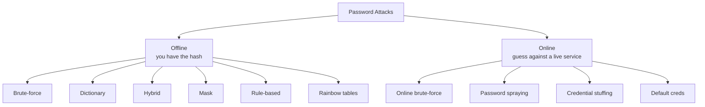

# Password Attack Types

## Up
- [[Password Cracking]]

The taxonomy of ways passwords are attacked — the concepts behind every tool in this category. Knowing which attack fits a situation (and its cost/noise trade-offs) is what makes cracking efficient. Authorized scope only.

---

## The Big Picture

---

## Offline Attacks (against captured hashes)

### Brute-force
Try **every possible combination** of characters up to a length. Guaranteed to succeed eventually, but cost grows exponentially with length/charset — only practical for short passwords or fast hashes.

- Search space = charset_size ^ length. Adding one character or the full ASCII set explodes the time.
- Tools: [[Hashcat]] `-a 3`, [[John the Ripper]] incremental mode.

### Dictionary (wordlist) attack
Hash each entry in a **wordlist** of likely passwords and compare. Vastly faster than brute-force because most human passwords are not random.

- Effectiveness depends entirely on list quality — see [[Wordlists]] (rockyou, SecLists).
- Tools: [[Hashcat]] `-a 0`, John `--wordlist`.

### Rule-based attack
Apply **mangling rules** to each wordlist word to model how humans modify passwords: capitalize, append digits/years, leetspeak (`a→@`, `s→$`), duplicate, reverse.

- `password` → `Password1`, `P@ssw0rd!`, `password2026`, …
- Huge force-multiplier on a base wordlist. Tools: Hashcat `-r rules/best64.rule`, John `--rules`.

### Hybrid attack
Combine a **wordlist with a brute-forced portion** (mask). Models "word + suffix" patterns like `summer2024!`.

- Wordlist + mask: `?l?l?l + 2024` etc. Tools: Hashcat `-a 6` (word+mask) / `-a 7` (mask+word).

### Mask attack
A **targeted brute-force** using a known pattern instead of the full keyspace. If policy forces "Upper + 6 lower + 2 digits + symbol", you only search that shape.

- Charset placeholders: `?l` lower, `?u` upper, `?d` digit, `?s` symbol, `?a` all.
- Example: `?u?l?l?l?l?l?d?d` → 8-char "Ualice12"-style. Tool: Hashcat `-a 3`.

### Rainbow table attack
Use **precomputed** hash→plaintext lookup tables (a time-memory trade-off) to reverse **unsalted** hashes almost instantly — you trade huge disk space for cracking speed.

- Only works on **unsalted** algorithms (classic Windows **LM/NTLM**, plain MD5/SHA1). **Salting defeats it entirely.**
- Tool: [[Ophcrack]] (Windows LM/NTLM with downloadable tables); rcracki_mt.

---

## Online Attacks (against a live service)

### Online brute-force / dictionary
Submit guesses directly to a login (SSH, RDP, FTP, HTTP form, SMB…). Slow and **noisy** — subject to lockouts, rate limits, and logging.

- Tool: [[Hydra]] (also medusa, ncrack, patator).

### Password spraying
Try **a few common passwords across MANY accounts** (e.g. `Winter2026!` against every user) instead of many passwords against one account — this **avoids lockouts** by staying under the per-account failure threshold.

- Needs a username list (from [[OSINT]]/theHarvester). Throttle and respect lockout windows.

### Credential stuffing
Replay **username:password pairs leaked from other breaches**, betting on password reuse across sites.

- Uses breach-combo lists; MFA is the primary defense.

### Default / weak credentials
Try vendor defaults (`admin:admin`, `root:toor`, device-specific defaults). Surprisingly effective on appliances, IoT, DBs, and admin panels.

---

## Choosing an Attack (cheat rules)

| Situation | Best first move |
|---|---|
| Have a fast unsalted hash (MD5/NTLM) | Wordlist + rules → mask → rainbow tables ([[Ophcrack]] for LM/NTLM) |
| Have a slow/salted hash (bcrypt/argon2) | Targeted wordlist + rules only — brute-force is infeasible |
| Know the password policy | **Mask** attack matching the pattern |
| Live service, one account | Small dictionary, watch lockouts (or don't — prefer spraying) |
| Many accounts, no lockout intel | **Password spraying** with a few common passwords |
| Have breach combos | **Credential stuffing** |
| Appliance / new device | **Default credentials** first |

---

## Defensive Notes (blue team)

- Use **slow, salted** hashes (bcrypt/scrypt/argon2) — kills rainbow tables and slows brute-force.
- Enforce **length over complexity** (passphrases), block breached passwords (HIBP), and require **MFA** (defeats stuffing/spraying).
- Detect spraying: many accounts, few attempts each, from one source; alert on auth anomalies.
- Account lockout + rate limiting raise the cost of every online attack.
