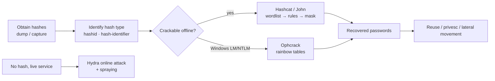

# Password Cracking

## Up
- [[Hacking]]

Password cracking is the process of recovering plaintext passwords from hashes (offline) or guessing valid credentials against a live service (online). It's central to post-exploitation, privilege escalation, and access-control testing. Start with the **[[Password Attack Types]]** concepts, then the tooling.

> **Scope & ethics:** only crack hashes you're authorized to possess and only test credentials against systems in an approved scope. Cracked passwords and dumped hashes are sensitive — handle and store them per the rules of engagement. Educational reference.

## Subtopics
- [[Password Attack Types]] — the taxonomy: brute-force, dictionary, hybrid, mask, rule-based, spraying, stuffing, rainbow tables
- [[Hashcat]] — GPU-accelerated offline hash cracker
- [[John the Ripper]] — versatile offline cracker (+ `*2john` extractors)
- [[Hydra]] — online/network login brute-forcer
- [[Ophcrack]] — rainbow-table cracker for Windows LM/NTLM hashes
- [[Wordlists]] — SecLists, rockyou, and generating custom lists

## Related
- [[OSINT]] — theHarvester/dorking feed username & email lists for spraying
- [[Reconnaissance]] — identifies the services Hydra targets

---

## Offline vs Online — the key split

| | Offline | Online |
|---|---|---|
| **Target** | A stolen hash (you already have it) | A live login (SSH, RDP, web form, …) |
| **Speed** | Very fast (millions–billions/sec on GPU) | Slow (network + lockouts + rate limits) |
| **Detectability** | Silent (no target contact) | Noisy — logs, lockouts, alerts |
| **Tools** | [[Hashcat]], [[John the Ripper]], [[Ophcrack]] | [[Hydra]], medusa, patator, ncrack |
| **Limiter** | Hash algorithm strength + hardware | Lockout policy, MFA, rate limiting |

The whole discipline turns on: *do I have the hash (crack it fast, quietly) or must I guess against a service (slow, loud, careful)?*

---

## Typical Flow

---

## Cracking Concepts

- **Hash identification first** — you can't pick a mode without knowing the algorithm (`hashid`, `hash-identifier`, or hashcat's `--identify`). MD5, NTLM, SHA-256, bcrypt, and Kerberos hashes all need different handling.
- **Fast vs slow hashes** — MD5/NTLM crack billions/sec; **bcrypt/scrypt/argon2/PBKDF2** are deliberately slow (salted + many rounds), so mask/brute-force is often infeasible — pivot to targeted wordlists + rules.
- **Salting** — a per-hash random value defeats precomputation (rainbow tables) and forces cracking each hash individually.
- **Escalate cheaply first:** wordlist → wordlist + rules → hybrid/mask → pure brute-force (last resort).
- **Cracked once, reused everywhere** — feed recovered passwords back in (password reuse), and build target-specific wordlists from OSINT.
