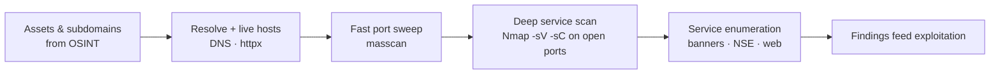

# Reconnaissance

## Up
- [[Hacking]]

Active reconnaissance — directly probing target infrastructure to discover live hosts, open ports, running services, versions, and OS details. This is the "hands-on-the-network" phase that follows passive intel gathering (see the sibling **[[OSINT]]** category) and feeds enumeration and exploitation.

> **Scope & ethics:** active scanning touches target systems and can be logged/alerted on — only scan assets you are **explicitly authorized** to test. Educational reference.

## Subtopics
- [[Nmap]] — port scanning, service/version & OS detection, NSE scripts
- [[Masscan]] — internet-scale asynchronous port scanner

## Related
- [[OSINT]] — passive, open-source intelligence gathering (do this first)

---

## Passive (OSINT) → Active (Reconnaissance)

| | Passive → see [[OSINT]] | Active → this node |
|---|---|---|
| **Contact with target** | None (third-party/public data) | Directly probes target systems |
| **Detectability** | Very low | Can be logged / alerted on |
| **Examples** | Shodan, WHOIS, cert transparency, dorks, theHarvester | Nmap, masscan, DNS brute-force, banner grabbing |
| **When** | First — build the picture quietly | After OSINT, to confirm live/exposed services |

Work outside-in: **[[OSINT]]** (assets, subdomains, exposed services) → resolve to live hosts → **active port/service scanning** here → service enumeration.

---

## Active Recon Workflow



Standard pattern: **[[Masscan]]** finds open ports fast across a big range, then **[[Nmap]]** does deep service/version/NSE scanning only on those open ports.

---

## Foundational CLI (active resolution & probing)

```bash
# resolve OSINT-discovered subdomains to live hosts
cat subs.txt | httpx -silent           # projectdiscovery httpx

# DNS probing
dig axfr @ns1.example.com example.com   # zone transfer (often refused, worth testing)
dnsx -l subs.txt -a -resp               # bulk resolve

# quick liveness before heavy scanning
nmap -sn 10.0.0.0/24                     # ping sweep
```

---

## Key Concepts

- **Host discovery** — determining which addresses are alive before port scanning (ping sweep, TCP/UDP pings, or `-Pn` when ICMP is blocked).
- **Port scanning** — mapping open/closed/filtered ports (TCP SYN, connect, UDP).
- **Service/version detection & enumeration** — moving from "a port is open" to "what software/version/config runs there" (banners, `-sV`, NSE).
- **OS fingerprinting** — inferring the operating system from network-stack behaviour.
- **Two-stage scanning** — breadth first (masscan) then depth (Nmap) is far faster than deep-scanning every port on every host.
- **Golden rule:** thorough OSINT + recon determines everything downstream — time here is never wasted.
