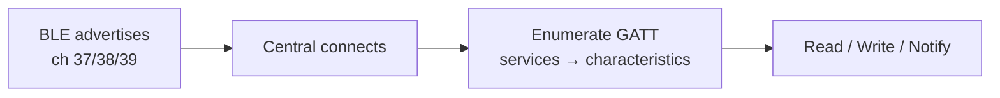
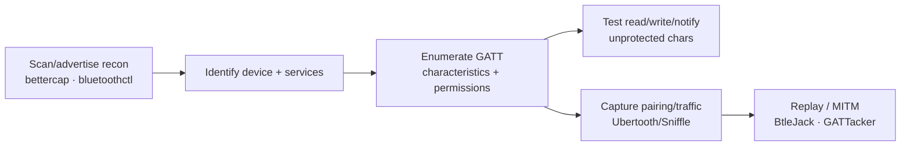

# Bluetooth

## Up
- [[Wireless]]

Bluetooth comes in two very different flavours — **Classic (BR/EDR)** and **Bluetooth Low Energy (BLE)** — both at 2.4 GHz but with different stacks, pairing, and attack surfaces. It's everywhere (audio, wearables, medical, locks, IoT), making it a rich target. Authorized devices only; intercepting others' traffic is illegal.

---

## Theory — How Bluetooth Works

- **Band:** 2.4 GHz ISM, **FHSS** (frequency hopping) — Classic hops across 79×1 MHz channels ~1600×/s; BLE uses 40×2 MHz channels. Hopping is *why* sniffing needs special hardware that follows the pattern (see [[RF Fundamentals]]).
- **Classic (BR/EDR):** continuous connections, higher throughput — audio, file transfer, tethering.
- **BLE (4.0+):** low-power, short bursts — beacons, sensors, wearables, smart locks. Uses 3 **advertising channels (37/38/39)** for discovery, then data channels once connected.

### BLE data model — GATT/ATT
BLE data is organised as **Services → Characteristics → Descriptors**, accessed over **GATT** (Generic Attribute Profile) on top of **ATT**. Enumerating GATT (read/write/notify characteristics) is the core of BLE assessment — an unlocked "write" characteristic might open a lock or change device state.

### Pairing & keys
Pairing establishes a **Long-Term Key (LTK)**. Methods: **Just Works** (no MITM protection — common and weak), **Passkey Entry**, **Numeric Comparison**, **OOB**. **LE Secure Connections** (BT 4.2+) adds ECDH; older **Legacy Pairing** is weaker. Weak/Just-Works pairing is a frequent finding.

---

## Attacks

### Classic (BR/EDR)
| Attack | What it does |
|---|---|
| **Bluejacking** | Send unsolicited messages (nuisance/spam) |
| **Bluesnarfing** | Steal data (contacts, files) via OBEX flaws on old devices |
| **Bluebugging** | Gain command/control of an older device |
| **KNOB** | Downgrade encryption key **entropy** to ~1 byte during negotiation → brute-force the link key |
| **BIAS** | Impersonation via flaws in secure-connection authentication |
| **BlueBorne** (2017) | Suite of RCE/MITM vulns exploitable with no pairing (patched) |

### BLE
| Attack | What it does |
|---|---|
| **Passive sniffing** | Capture advertising/connection packets (esp. if Legacy/Just-Works) → decrypt/replay |
| **GATT abuse** | Enumerate and write unprotected characteristics → control the device |
| **Replay** | Re-send captured commands (e.g. unlock) when there's no nonce/freshness |
| **MITM / clone** | Impersonate a peripheral (e.g. **GATTacker**, BtleJuice) — proxy between app and device |
| **Sweyntooth** | Family of BLE SoC stack vulns (crash/deadlock/bypass) |
| **Static-passkey / weak pairing** | Brute-force or bypass poor pairing |

---

## Tools

| Tool | Role |
|---|---|
| `bluetoothctl` / `hciconfig` / `hcitool` | Linux BlueZ stack: scan, info, connect (some deprecated) |
| `gatttool` / **nRF Connect** (mobile) | Enumerate & interact with GATT services/characteristics |
| **bettercap** (`ble.recon`, `ble.enum`) | BLE scanning, enumeration, read/write characteristics |
| **Ubertooth One** | Open-source 2.4 GHz sniffer — follow Classic/BLE, monitor mode |
| **Sniffle** (+ nRF52840 dongle) | Excellent BLE 5 sniffer, connection following |
| **BtleJack** (+ micro:bit) | BLE sniffing, jamming, **connection hijacking** |
| **GATTacker / BtleJuice** | BLE MITM — clone a peripheral, proxy & tamper |
| **Bluing** | Bluetooth (BR/EDR + BLE) recon framework |

Discovery/interaction (bluetoothctl, bettercap, nRF Connect) works with a normal adapter; **over-the-air sniffing** of hopping/connections needs **Ubertooth/Sniffle/BtleJack**.

---

## Assessment Workflow

---

## Defenses

- Use **LE Secure Connections** with **Numeric Comparison/Passkey** (avoid **Just Works** for anything sensitive); enforce MITM protection.
- Add **application-layer** auth + encryption and **anti-replay** (nonces/counters) on GATT commands — don't trust link-layer pairing alone.
- Require bonding for sensitive characteristics; minimise advertising data; use rotating/random MAC addresses (privacy).
- Keep BLE SoC/stack firmware patched (Sweyntooth/BlueBorne class). Disable Classic discoverability when idle.

---

## Takeaways

- **Classic ≠ BLE** — different stacks and attacks; know which you're testing.
- **FHSS** means real sniffing needs **Ubertooth/Sniffle/BtleJack**, not a plain adapter.
- For BLE, the money is in **GATT enumeration** + **weak pairing/replay** — unprotected write characteristics and Just-Works pairing are the common wins.
- Downgrade/negotiation flaws (**KNOB**) show why key-strength negotiation must be protected.
