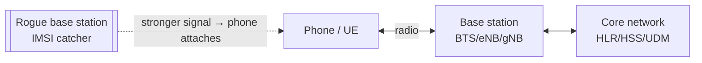

# Cellular

## Up
- [[Wireless]]

Cellular networks (2G GSM → 3G UMTS → 4G LTE → 5G) connect phones and IoT to carrier infrastructure. Attacks center on **rogue base stations (IMSI catchers)**, **protocol downgrades**, and legacy-crypto weaknesses.

> **⚠️ Strong legal warning:** transmitting on licensed cellular spectrum, operating a base station, or intercepting cellular traffic is **illegal** in virtually every country and tightly enforced. Legitimate work happens on **test networks in RF-shielded labs** with proper authorization, or is **RX-only research** on your own device. This node is **theory/defensive**; treat operational attacks as off-limits without explicit legal authority.

---

## Theory — Generations & Architecture

| Gen | Tech | Key crypto | Notes |
|---|---|---|---|
| **2G** | GSM | A5/1, A5/2 (stream ciphers) | **Broken**; **no mutual auth** (phone can't verify the tower) → IMSI catchers |
| **3G** | UMTS | KASUMI (f8/f9) | Adds **mutual authentication** (AKA) |
| **4G** | LTE | SNOW 3G / AES (EPS-AKA) | Strong crypto, but some pre-auth messages unprotected |
| **5G** | NR | 256-bit-capable, **SUCI** conceals IMSI | Best privacy (encrypted subscriber ID), still SA-vs-NSA nuances |

- **Key IDs:** **IMSI** (permanent subscriber ID on the SIM), **TMSI** (temporary), **IMEI** (device ID). Protecting the IMSI is central — 5G's **SUCI** encrypts it to stop catchers.
- **Architecture (simplified):** UE (phone) ↔ **base station** (BTS/NodeB/eNodeB/gNodeB) ↔ core network (HLR/HSS/UDM for subscriber data). The phone trusts whichever tower is strongest — the crux of the rogue-tower problem.

---

## Attacks (concepts)

### IMSI Catcher / "Stingray" (rogue base station)
A fake tower broadcasts a stronger signal so nearby phones attach. Because **2G has no mutual auth**, the catcher can **capture IMSIs** (track/identify devices) and often **force a 2G downgrade** to weak/no encryption, enabling interception. Used for surveillance; also a privacy threat to protesters/journalists.

### Downgrade attacks
Jam/deny 4G/5G or advertise capabilities so the phone falls back to **2G**, then exploit GSM's weak crypto and lack of mutual auth. 5G/4G "aka bypass" and pre-auth message spoofing are active research areas.

### Legacy GSM crypto
**A5/1** (and the deliberately weak A5/2) are broken (rainbow tables/known attacks) → passive decryption of 2G calls/SMS where still present.

### SS7 / Diameter (signaling — network side)
Flaws in inter-carrier **SS7** (2G/3G) and **Diameter** (4G) signaling allow location tracking, call/SMS interception, and OTP theft — abused against **SMS 2FA**. These are core-network attacks, not radio.

### SIM / device
**Simjacker** (malicious SMS to the SIM's S@T browser), SIM-swap (social-engineering the carrier), and baseband vulns.

---

## Tools (research / defensive)

| Tool | Role |
|---|---|
| **gr-gsm / Airprobe** ([[SDR]]) | Capture & decode **downlink** GSM signaling for research |
| **IMSI-catcher (scripts)** | Detect/observe GSM cell parameters with RTL-SDR |
| **srsRAN / OpenBTS / YateBTS** | Build a **test** LTE/GSM network — lab/shielded use only |
| **Crocodile Hunter / SnoopSnitch (Android)** | **Detect** IMSI catchers / downgrade attempts (defensive) |
| **USRP / bladeRF** | The radios research base stations run on |

RTL-SDR (RX-only) + `gr-gsm` is the safe way to *study* GSM signaling. Anything transmitting requires a shielded lab and authorization.

---

## Defenses

- Prefer **VoLTE/VoWiFi**, disable **2G** on the device where possible (modern Android/iOS allow this), enable **"5G/LTE only"**.
- Use **app-based auth / passkeys** instead of **SMS OTP** (SS7-vulnerable).
- End-to-end encryption (Signal, etc.) protects content regardless of the radio layer.
- Enterprises/carriers: SS7/Diameter **firewalls**, and 5G **SA** with SUCI for IMSI privacy.
- Use IMSI-catcher detectors (SnoopSnitch/Crocodile Hunter) in high-risk contexts.

---

## Takeaways

- The core problem is **2G's lack of mutual authentication** → IMSI catchers + downgrade attacks; the fix is disabling 2G and moving to **4G/5G with mutual auth and SUCI**.
- **SMS 2FA is weak** (SS7/Diameter + SIM swap) — prefer app/passkey MFA.
- Practically, cellular hacking is **legally radioactive** — study it RX-only or in a licensed shielded lab; focus your energy on **detection and defense**.
