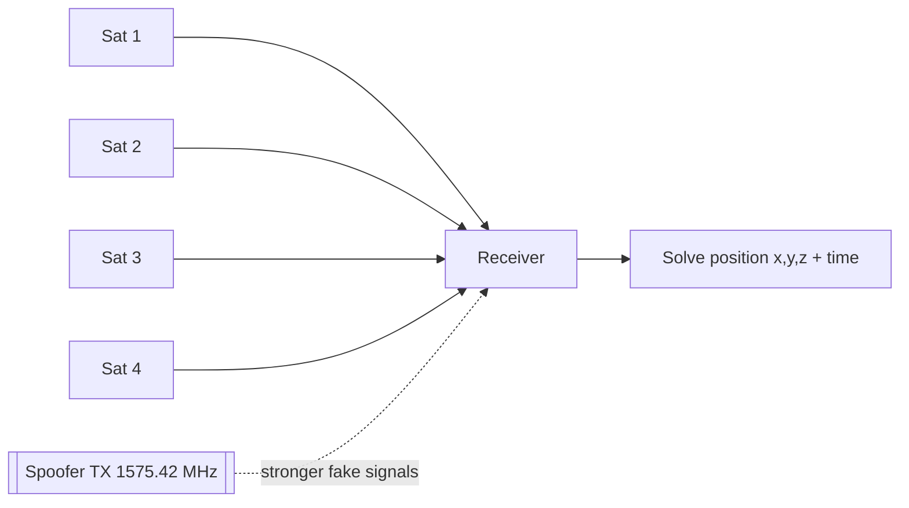

# GPS & GNSS

## Up
- [[Wireless]]

GNSS (Global Navigation Satellite Systems) — **GPS** (US), **GLONASS** (RU), **Galileo** (EU), **BeiDou** (CN) — provide position, navigation, and **precise timing** to phones, vehicles, drones, ships, and critical infrastructure (power grids, finance, telecom sync). Civilian signals are **unencrypted and extremely weak**, making **jamming and spoofing** the headline threats.

> **⚠️ Strong legal warning:** transmitting on GNSS frequencies — even low power — is **illegal** and dangerous (it can disrupt aircraft, emergency services, and infrastructure over a wide area). Spoofing/jamming experiments must be done **only inside a fully RF-shielded chamber / cabled setup** with authorization. This node is largely theory/defensive.

---

## Theory — How GNSS Works

- **Positioning by trilateration + time:** each satellite broadcasts its position and a precise timestamp; the receiver measures signal **time-of-flight** from ≥4 satellites to solve for **x, y, z, and clock offset**. GNSS is therefore also a **precise time source**, which is why timing attacks matter as much as position.
- **Frequencies:** GPS civilian **L1 C/A at 1575.42 MHz** (also L2/L5); other constellations nearby.
- **Signal is tiny:** received power is **below the noise floor** (~−125 dBm), recovered via **DSSS** de-spreading with each satellite's code (see [[RF Fundamentals]]). This weakness is why a modest transmitter can overpower real satellites.
- **Civilian = unauthenticated:** the C/A code is public and unsigned → a receiver can't tell a real satellite from a fake one. (Military **P(Y)/M-code** is encrypted; Galileo **OSNMA** adds civilian authentication — an emerging defense.)



---

## Attacks

### Jamming (denial)
Transmit noise on L1 to raise the noise floor so receivers **lose lock** — GPS "goes dark." Cheap "personal privacy device" jammers exist (and are illegal); they can knock out navigation/timing across a large area.

### Spoofing (deception)
Transmit **counterfeit satellite signals** so the receiver computes a **false position or time**. Two styles:
- **Simplistic** — broadcast a static fake location (a phone/drone believes it's elsewhere).
- **Advanced (seamless takeover)** — align fake signals with the real ones, then slowly drag the solution away without a visible glitch (famous drone/ship-misdirection demonstrations).

### Meaconing / replay
Record genuine GNSS and **rebroadcast** it (delayed) — the receiver adopts the recorded position/time.

### Timing attacks
Because grids, cell networks, and finance rely on GNSS time, spoofing the **clock** can disrupt infrastructure even when position isn't the goal.

---

## Tools (research / shielded only)

| Tool | Role |
|---|---|
| **gps-sdr-sim** (+ HackRF/bladeRF) | Generate GPS L1 baseband to **simulate** a location — cabled/shielded testing |
| **GNSS-SDR** | Open-source software receiver (RX/analysis) |
| **[[SDR]]** (HackRF/USRP) | The radio for generating/receiving GNSS in a lab |
| **Commercial GNSS simulators** (Spirent, etc.) | Legitimate, contained receiver testing |
| **u-blox / GNSS receivers with anti-spoofing** | Detection & hardened positioning |

```text
# ILLUSTRATIVE — shielded/cabled lab ONLY, never over the air
gps-sdr-sim -e brdc.n -l 37.77,-122.41,100 -o gps.bin   # synth a location
# then transmit gps.bin with an SDR into a SHIELDED receiver
```

---

## Defenses & Anti-Spoofing

- **Detection:** watch for anomalies — sudden position jumps, impossible velocity, C/N₀ spikes, time discontinuities, too-uniform signal strength across satellites.
- **Multi-constellation + multi-frequency** receivers are harder to spoof consistently.
- **Signal authentication:** Galileo **OSNMA** (navigation-message authentication) and, for authorized users, encrypted military codes.
- **Sensor fusion:** cross-check GNSS with **IMU/INS**, odometry, map-matching, and (for timing) local atomic/holdover clocks so a spoof is caught by disagreement.
- **Antenna techniques:** CRPA/beam-steering antennas can null out ground-based spoofers.

---

## Takeaways

- GNSS civilian signals are **weak and unauthenticated** → **jamming (deny)** and **spoofing (deceive)** are the core threats; advanced spoofing can take over a receiver seamlessly.
- **Timing** disruption is as serious as position (grids, telecom, finance).
- Testing is **legally hazardous** — only in a **shielded/cabled** setup; over-the-air TX endangers aircraft and infrastructure.
- Defenses = **anomaly detection + multi-constellation + authentication (OSNMA) + sensor fusion**.
