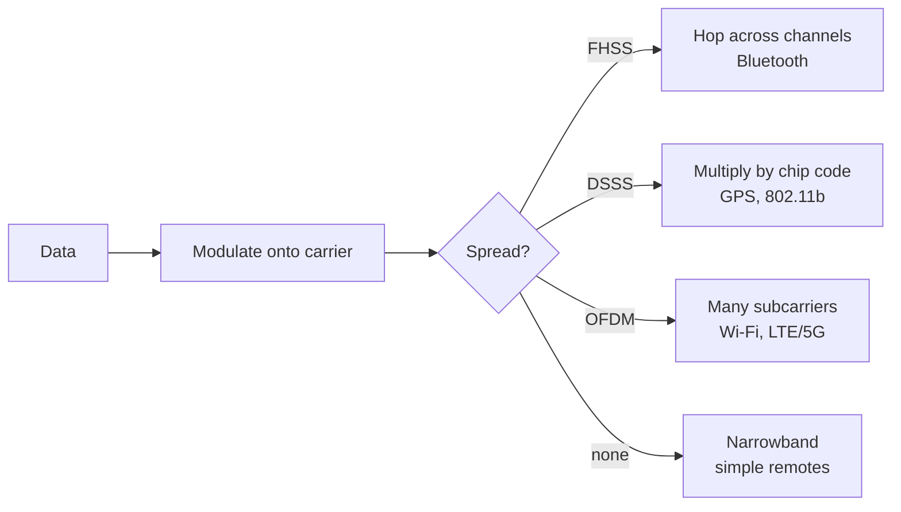
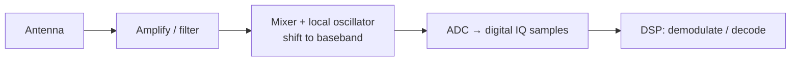

# RF Fundamentals

## Up
- [[Wireless]]

The physics and signal theory behind **every** wireless technology. Understanding waves, modulation, spread spectrum, and antennas is what lets you recognise an unknown signal, choose the right radio, and reason about an attack — before touching a single tool.

---

## Radio Waves & the Spectrum

- A radio wave is an electromagnetic wave defined by **frequency** (`f`, in Hz) and **wavelength** (`λ`). They relate by **c = f × λ** (c ≈ 3×10⁸ m/s). Higher frequency → shorter wavelength.
- Rough behaviour: **lower frequencies** travel farther and penetrate walls better but carry less data; **higher frequencies** carry more data but are shorter-range and more easily blocked.

| Band | Range | Typical use |
|---|---|---|
| LF | 30–300 kHz | 125 kHz prox cards |
| HF | 3–30 MHz | 13.56 MHz NFC/RFID |
| VHF | 30–300 MHz | FM radio, some IoT |
| UHF | 300 MHz–3 GHz | Wi-Fi 2.4, BT, cellular, key fobs |
| SHF | 3–30 GHz | Wi-Fi 5/6, radar, satellite |

### ISM bands (where most hacking happens)
**Industrial, Scientific, Medical** bands are licence-free for low-power devices — which is why consumer wireless clusters there: **433 MHz, 915 MHz (US) / 868 MHz (EU), 2.4 GHz, 5.8 GHz**. Licence-free ≠ lawless: power limits and rules still apply, and jamming/interception remain illegal.

---

## Modulation — encoding data onto a carrier

A **carrier** wave is varied to carry information. Three properties can be modulated: **amplitude, frequency, phase**.

| Scheme | Varies | Notes / where seen |
|---|---|---|
| **AM** | Amplitude | Simple, noise-prone |
| **FM** | Frequency | Robust to amplitude noise; FM radio |
| **ASK / OOK** | Amplitude (OOK = on/off keying) | Cheap sub-GHz remotes, key fobs |
| **FSK / GFSK** | Frequency shift | Bluetooth (GFSK), many IoT |
| **PSK (BPSK/QPSK)** | Phase | Efficient; used in many digital links |
| **QAM** | Amplitude + phase | High data rate; Wi-Fi, cable, LTE |

- **Symbol vs bit:** higher-order schemes (16-QAM, 256-QAM) pack more bits per symbol → faster but need a cleaner signal (higher SNR).
- Recognising modulation from a waveform/waterfall is a core reversing skill (tools: [[SDR]] + Universal Radio Hacker).

---

## Spread Spectrum (why 2.4 GHz devices coexist)

To resist interference and eavesdropping, many radios spread the signal across bandwidth:

- **FHSS** (Frequency-Hopping Spread Spectrum) — rapidly hop between channels on a shared pattern. **Bluetooth** uses this (1600 hops/s) — which is exactly why sniffing BT requires special hardware that follows the hops.
- **DSSS** (Direct-Sequence Spread Spectrum) — multiply data by a faster pseudo-random "chipping" code, spreading it over a wide band. Used by legacy 802.11b, GPS.
- **OFDM** (Orthogonal Frequency-Division Multiplexing) — split data across many closely spaced subcarriers; the backbone of modern **Wi-Fi (a/g/n/ac/ax)**, **LTE/5G**, and DVB.

---

## Power, Gain & Link Budget (the dB world)

- **dB** is a logarithmic ratio; **dBm** is power relative to 1 mW (0 dBm = 1 mW, +30 dBm = 1 W).
- Rules of thumb: **+3 dB ≈ ×2 power**, **+10 dB ≈ ×10**, **−3 dB ≈ half**.
- **RSSI** — received signal strength (how strong a signal arrives); used for proximity, rogue-AP hunting, war-driving heatmaps.
- **SNR** (signal-to-noise ratio) determines how much data you can reliably decode — low SNR breaks high-order modulation first.
- **Link budget** = TX power + antenna gains − path loss − losses; determines range.

---

## Antennas

- **Omnidirectional** (rubber duck, dipole) radiate in all directions — general use, war-driving.
- **Directional** (Yagi, panel, parabolic/grid) focus energy one way — long range, targeting a specific AP, or discreet capture from distance.
- **Gain** (dBi) describes focusing, not amplification — a high-gain antenna trades coverage angle for reach.
- **Polarization** (vertical/horizontal/circular) must roughly match between antennas for good coupling.
- **Frequency-specific:** an antenna is cut for a band — a 2.4 GHz antenna won't work well at 433 MHz. Match antenna to target band.

---

## The Receive/Transmit Signal Chain

- **IQ samples** (In-phase / Quadrature) are how [[SDR]] represents a captured signal digitally — two streams that together encode amplitude *and* phase.
- **Sample rate & Nyquist:** to capture a signal of bandwidth B you must sample at ≥ 2B. An SDR's sample rate sets how much spectrum you can see at once.

---

## Key Terms Cheat-Sheet

| Term | Meaning |
|---|---|
| Carrier | Base wave that gets modulated |
| Baseband | The raw signal before/after carrier |
| Bandwidth | Frequency width a signal occupies |
| Channel | An allocated frequency slot |
| Duplex | Half (TX or RX) vs full (both at once) |
| Waterfall | Time-vs-frequency spectrogram (how you *see* signals) |
| Duty cycle | Fraction of time a transmitter is on |

---

## Takeaways

- **f, modulation, and bandwidth** are the three things to identify about any unknown signal — they tell you what it is and how to attack it.
- **Spread spectrum** (esp. FHSS in Bluetooth, OFDM in Wi-Fi/LTE) explains why some radios need specialised sniffers.
- Think in **dBm** and **SNR** to reason about range, capture distance, and why an attack works at 2 m but not 20 m.
- Match your **antenna and radio to the band** — the biggest practical mistake is wrong hardware for the frequency.
- This theory underpins every child node; the general-purpose way to *apply* it is [[SDR]].
