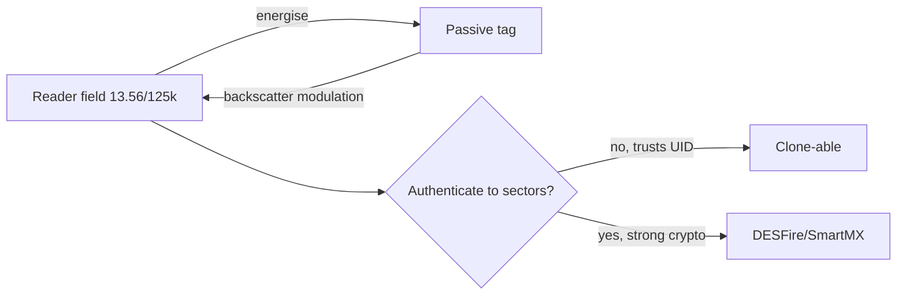

# RFID & NFC

## Up
- [[Wireless]]

RFID (Radio-Frequency IDentification) and NFC (Near-Field Communication) power access badges, transit cards, payment, passports, and inventory tags. Because many deployed tags use **weak or no crypto**, cloning and replay are common — this is the classic "clone the office badge" attack surface. Test only cards/systems you own or are authorized to assess.

---

## Theory — How RFID/NFC Works

RFID is **inductive coupling**: a reader energises a passive tag via a magnetic field; the tag replies by modulating the field (backscatter). Tags are usually **passive** (no battery). NFC is a **subset of HF RFID** (13.56 MHz) for very short range two-way comms.

| Band | Freq | Range | Typical tags |
|---|---|---|---|
| **LF** | 125–134 kHz | ~cm | EM4100, HID Prox — old building access, animal chips |
| **HF** | 13.56 MHz | ~cm–10 cm | MIFARE Classic/DESFire, NTAG, ISO 14443/15693; transit, payment |
| **NFC** | 13.56 MHz | <4 cm | Phones, payment, tap-to-pair (ISO 18092) |
| **UHF** | 860–960 MHz | m | Supply-chain/inventory (EPC Gen2) |

- **Standards:** ISO **14443** (A/B, proximity — MIFARE/NFC), ISO **15693** (vicinity), ISO **18092** (NFC).
- **UID vs data:** every tag has a **UID**; secure systems must authenticate to sectors, **not just trust the UID** (many badge systems wrongly trust the UID → trivial clone).



---

## The Weak Spots

| Tag/tech | Weakness |
|---|---|
| **EM4100 / HID Prox (LF)** | No auth — read UID, clone to writable T5577/blank |
| **MIFARE Classic (HF)** | **Crypto1** cipher is broken (nested/darkside/hardnested attacks) → recover keys, dump, clone |
| **MIFARE Ultralight / NTAG** | Often no/weak auth → read & rewrite |
| **UID-only access systems** | Read the UID, write it to a "magic" card → instant clone |
| **DESFire EV1/2/3, SmartMX** | Strong (AES/3DES) — resistant if configured right |

---

## Attacks

- **Cloning** — read a tag and write its data/UID to a blank ("magic") card. LF prox and MIFARE Classic are routine.
- **Key cracking (MIFARE Classic)** — recover sector keys via Crypto1 flaws (`mfoc` if one key known, `mfcuk`/hardnested otherwise), then dump all sectors.
- **Replay** — re-present captured card data to a reader.
- **Relay attack** — extend range in real time: one device near the card, one near the reader, tunnelled over the network (defeats "proximity" assumption; relevant to payments/keyless entry).
- **Sniffing/eavesdropping** — capture reader↔tag exchange (short range).
- **Downgrade/misconfig** — systems that fall back to UID-only or leave default keys (`FFFFFFFFFFFF`).

---

## Tools

| Tool | Role |
|---|---|
| **Proxmark3** (RDV4) | The RFID/NFC swiss-army — LF+HF read/clone/crack/emulate/sniff; MIFARE attacks built in |
| **Flipper Zero** | Portable LF/HF (+ NFC) read/emulate/clone; great for prox & simple tags |
| **libnfc / nfc-tools** | `nfc-list`, `nfc-mfclassic` — read/write with a PN532 reader |
| **mfoc / mfcuk / mfterm** | MIFARE Classic key recovery & dumping |
| **ChameleonMini / ChameleonUltra** | Emulate/clone HF cards, store multiple identities |
| **ACR122U + PN532** | Cheap USB NFC readers for scripting |

```text
# Proxmark3 (illustrative)
lf search                     # identify an LF tag
lf hid clone -r <id>          # write HID prox to a T5577
hf search                     # identify an HF tag
hf mf autopwn                 # recover MIFARE Classic keys + dump
hf mf restore                 # write dump to a magic card
```

---

## Defenses

- Use **cryptographic tags** (MIFARE **DESFire EV2/3**, SmartMX) with **AES**, diversified keys, and mutual authentication — never trust the **UID** alone.
- Enable **anti-replay/anti-relay** (transaction counters, timing/distance bounding).
- Rotate default keys; segment door controllers; add a **second factor** (PIN/biometric) for high-value doors.
- Use **RFID-shielding** sleeves for sensitive cards/passports; monitor for cloned-UID anomalies.

---

## Takeaways

- **LF prox and MIFARE Classic are effectively clone-on-sight** — the crypto is broken or absent.
- The #1 design flaw is **trusting the UID**; secure systems authenticate to encrypted sectors.
- **Proxmark3** (powerful) and **Flipper Zero** (portable) are the go-to tools; MIFARE cracking uses `mfoc`/`mfcuk`/hardnested.
- **Relay attacks** break the "it must be near me" assumption — important for keyless entry and contactless payment.
