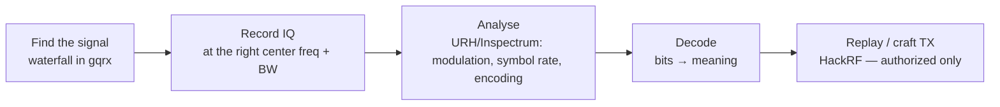

# SDR

## Up
- [[Wireless]]

**Software-Defined Radio** moves the radio's signal processing into software: hardware just samples raw RF into **IQ data**, and code does the demodulation/decoding. One SDR can therefore receive (and sometimes transmit) across a huge range of technologies — making it the **universal tool** for exploring "every wireless device." Builds on [[RF Fundamentals]].

> **Legal:** receiving is generally lower-risk, but **transmitting** with an SDR (HackRF/bladeRF) on licensed bands, or jamming, is illegal without authorization. TX only into a shielded/RF-isolated setup or on bands you're licensed for.

---

## The Hardware

| SDR | Freq range | TX? | Notes |
|---|---|---|---|
| **RTL-SDR** (RTL2832U dongle) | ~24–1766 MHz | ❌ RX only | ~$30; the entry point — ADS-B, sub-GHz, POCSAG, trunked radio |
| **HackRF One** | 1 MHz–6 GHz | ✅ half-duplex | ~$300; the hacker workhorse (RX+TX, 20 MHz BW) |
| **bladeRF** | 47 MHz–6 GHz | ✅ full-duplex | Higher performance, FPGA |
| **LimeSDR** | 100 kHz–3.8 GHz | ✅ full-duplex | Wide, open-source |
| **USRP** (Ettus) | wide (model-dependent) | ✅ | Research-grade, expensive, used for LTE/5G work |

Key specs: **frequency range**, **bandwidth / sample rate** (how much spectrum at once), **TX capability**, and **duplex** (half vs full). RX-only RTL-SDR covers most *learning*; HackRF is the common RX+TX choice.

---

## The Software

| Tool | Role |
|---|---|
| **GNU Radio** (+ gnuradio-companion) | Visual flowgraph DSP toolkit — build custom RX/TX chains |
| **gqrx / SDR#/SDR++** | General spectrum viewer + demodulator (waterfall, listen) |
| **Universal Radio Hacker (URH)** | Reverse-engineer unknown protocols: record, demodulate, decode, fuzz, replay |
| **Inspectrum** | Visually analyse captured IQ bursts (measure symbol rate) |
| **rtl_433** | Decode 433/868/915 MHz ISM devices (sensors, weather stations) |
| **dump1090** | ADS-B aircraft tracking (1090 MHz) |
| **CubicSDR** | Cross-platform spectrum browser |

```bash
# quick RTL-SDR sanity checks
rtl_test -t                       # detect dongle + tuner
rtl_fm -f 433.92M -M am - | ...   # tune & pipe demodulated audio/data
rtl_433 -f 433.92M                # auto-decode common ISM devices
gqrx                              # GUI waterfall + demod
```

---

## The SDR Workflow (capture → understand → replay)



1. **Locate** the signal on a waterfall (know the band from [[RF Fundamentals]] / device FCC ID).
2. **Record** IQ samples centred on it with enough bandwidth.
3. **Analyse** in URH/Inspectrum — identify modulation (OOK/FSK…), symbol rate, framing.
4. **Decode** to bits and interpret.
5. **Replay/transmit** (HackRF) to test — e.g. a static-code remote — in a lawful, isolated setup.

---

## What People Do With SDR (by band)

- **433/868/915 MHz** → decode & replay remotes, sensors → see [[Sub-GHz & ISM]] (`rtl_433`, URH).
- **1090 MHz** → track aircraft (ADS-B, `dump1090`).
- **1575.42 MHz** → GPS record/replay research → [[GPS & GNSS]] (`gps-sdr-sim` + HackRF).
- **GSM 900/1800** → capture with `gr-gsm` → [[Cellular]] (research/legal caution).
- **NFC/RFID, Bluetooth, Zigbee** → usually better with **purpose-built** hardware (Proxmark, Ubertooth, ApiMote) than a generic SDR, because of protocol timing/hopping.

---

## Tips & Gotchas

- **Start RX-only** (RTL-SDR) — you'll learn 90% of the concepts without any TX legal risk.
- **DC spike & aliasing:** tune slightly off-centre; respect Nyquist (sample rate ≥ 2× signal bandwidth).
- **Gain staging** matters — too much gain overloads the front end (spurs), too little buries weak signals.
- Add a **band-pass filter / LNA** for weak or crowded bands.
- **URH is the fast path** for unknown OOK/FSK remotes — record, auto-detect, replay, done.
- FHSS/OFDM signals ([[Bluetooth]], [[Wi-Fi]]) are hard with a plain SDR — reach for dedicated tools instead.
