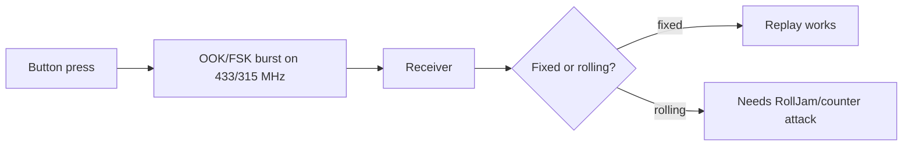

# Sub-GHz & ISM

## Up
- [[Wireless]]

The long tail of everyday radios living in **sub-GHz ISM bands** — car key fobs, garage/gate remotes, doorbells, alarm sensors, TPMS, weather stations, industrial remotes, and countless IoT gadgets. Many use **simple modulation and weak/no security**, making capture-and-replay the classic attack. Test only devices you own.

> **Legal:** RX (listening) is usually fine on ISM; **transmitting/replaying** may be regulated, and replaying to actuate someone else's device (a car, a gate) is illegal. TX only against your own equipment.

---

## Theory — The Bands & Signals

| Freq | Region/use |
|---|---|
| **315 MHz** | North America — car fobs, garage remotes, TPMS |
| **433.92 MHz** | EU/global ISM — remotes, sensors, weather stations (very common) |
| **868 MHz** | EU ISM — alarms, LoRa, Z-Wave |
| **915 MHz** | US ISM — LoRa, industrial, Z-Wave |

- **Modulation:** almost always simple — **OOK/ASK** (on-off keying) or **FSK/GFSK**. Easy to demodulate and reproduce with [[SDR]] (see [[RF Fundamentals]]).
- **Encoding:** raw bit patterns, often **PWM/Manchester**; frames repeat several times per press.
- **Security model (or lack of it):**
  - **Fixed/static code** — sends the same code every time → trivially replayable.
  - **Rolling code (hopping)** — code changes each press (e.g. **KeeLoq**) via a synced counter → naive replay fails, but attacks exist (below).



---

## Attacks

- **Capture & replay (fixed code):** record the burst, retransmit it → actuate the device. Works on cheap gates, older garage doors, some alarms/switches.
- **RollJam (rolling code):** **jam** the receiver while **capturing** the victim's press (they think it failed and press again); you capture a second valid code, forward the first, and keep the second unused → one free future unlock. Defeats naive rolling code.
- **Rolling-code counter/desync & KeeLoq attacks:** cryptographic weaknesses/known-key issues in some KeeLoq implementations; counter desynchronization tricks.
- **Brute-force:** small keyspaces on primitive fixed-code remotes (e.g. DIP-switch gates) can be swept.
- **Replay of sensors:** spoof alarm door/window sensors or TPMS (inject fake tire-pressure/IDs).
- **Reversing unknown protocols:** demodulate → recover bit framing → craft arbitrary commands (Universal Radio Hacker).

---

## Tools

| Tool | Role |
|---|---|
| **RTL-SDR** | RX-only capture/decode of 315/433/868/915 MHz ([[SDR]]) |
| **rtl_433** | Auto-decode hundreds of ISM devices (sensors, TPMS, weather, remotes) |
| **HackRF One** | RX **and TX** (replay/craft) across the range |
| **YARD Stick One** (+ **rfcat**) | Sub-GHz TX/RX dongle scriptable in Python (great for OOK/FSK) |
| **Flipper Zero** | Portable Sub-GHz capture/replay/brute (fixed codes), protocol library |
| **Universal Radio Hacker (URH)** | Record → demodulate → decode → fuzz → replay unknown protocols |
| **Inspectrum** | Visualise IQ bursts, measure symbol rate |

```bash
rtl_433 -f 433.92M                       # identify/decode nearby ISM devices
# capture + replay of a FIXED-code remote you own (URH or):
hackrf_transfer -r capture.iq -f 433920000 -s 2000000   # record
hackrf_transfer -t capture.iq -f 433920000 -s 2000000 -x 40   # replay (your device only)
```

---

## Defenses

- Use **rolling codes** done right (authenticated, anti-RollJam with time/challenge), or better, **cryptographically authenticated** protocols; avoid fixed codes for anything security-relevant.
- Add **challenge-response / bidirectional** links and **replay protection** (nonces/counters with resync limits).
- For vehicles: **UWB/BLE distance-bounding** for keyless entry to defeat relay/RollJam; PKE relay-attack mitigations.
- Detect **jamming** (a receiver seeing sustained noise before a "missed" press is suspicious); alarms should fail-safe and report jamming.

---

## Takeaways

- Most sub-GHz gadgets use **simple OOK/FSK with fixed codes** → **capture-and-replay** is the bread-and-butter attack; **[[SDR]] + URH / Flipper** are the tools.
- **Rolling codes** raise the bar but fall to **RollJam** and implementation flaws.
- `rtl_433` is the fastest way to inventory what's transmitting around you (RX-only, safe).
- The whole category is a direct application of [[RF Fundamentals]] + [[SDR]] — identify band → modulation → framing → replay/craft (on your own devices).
