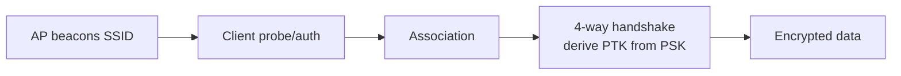

# Wi-Fi

## Up
- [[Wireless]]

Wi-Fi (IEEE **802.11**) is the most-tested wireless technology. This note covers how 802.11 works, its security generations (WEP→WPA3), the major attacks, and the toolchain. Authorized networks only — capturing/attacking others' Wi-Fi is illegal.

---

## Theory — How 802.11 Works

- **Bands/channels:** 2.4 GHz (crowded, 3 non-overlapping channels 1/6/11), 5 GHz (many channels), 6 GHz (Wi-Fi 6E). Modulation is **OFDM** (see [[RF Fundamentals]]).
- **Generations:** 802.11 a/b/g/n (Wi-Fi 4)/ac (Wi-Fi 5)/ax (Wi-Fi 6/6E)/be (Wi-Fi 7).
- **Frame types:** **Management** (beacons, probe, auth, assoc, **deauth**), **Control** (ACK, RTS/CTS), **Data**. Crucially, in WPA2 and earlier, **management frames are unauthenticated** — the root of deauth attacks.
- **Association flow:** AP beacons → client probes → authenticates → associates → (with a PSK) runs the **4-way handshake** to derive session keys.
- **BSSID** = AP's MAC; **ESSID** = network name; a client + AP form a BSS.



---

## Security Generations

| Protocol | Cipher | Key exchange | Status |
|---|---|---|---|
| **WEP** | RC4 | Static key + weak IV | **Broken** — crackable in minutes (IV reuse) |
| **WPA** | TKIP (RC4) | PSK / 802.1X | Deprecated, weak |
| **WPA2** | **CCMP (AES)** | 4-way handshake (PSK) or 802.1X (Enterprise) | Standard; PSK crackable offline if weak |
| **WPA3** | AES-GCMP | **SAE (Dragonfly)** — no offline crack of handshake | Current; forward secrecy, PMF mandatory |

- **Personal (PSK)** vs **Enterprise (802.1X/RADIUS, EAP)** — Enterprise authenticates each user (EAP-TLS/PEAP), attacked differently (rogue AP + EAP cred capture).
- **PMF** (Protected Management Frames, 802.11w) authenticates mgmt frames → mitigates deauth; mandatory in WPA3.

---

## Attacks

### Deauthentication / DoS
Because WPA2 mgmt frames are unauthenticated, spoofed **deauth** frames kick clients off. Used to force reconnection (to capture a handshake) or as DoS. **PMF/WPA3 blocks this.**

### WPA2-PSK handshake capture → offline crack
1. Monitor the channel, capture the **4-way handshake** (deauth a client to force reconnect).
2. Crack the PSK **offline** with a wordlist — it never touches the AP again.

```bash
airmon-ng start wlan0                          # enable monitor mode (wlan0mon)
airodump-ng wlan0mon                            # find target BSSID + channel
airodump-ng -c 6 --bssid AA:BB:.. -w cap wlan0mon   # capture on the channel
aireplay-ng --deauth 5 -a AA:BB:.. wlan0mon    # force a reconnect (in scope!)
aircrack-ng -w rockyou.txt cap-01.cap           # crack the captured handshake
```

### PMKID attack (clientless)
Some APs leak a **PMKID** in the first handshake message — grab it **without any client** and crack offline.

```bash
hcxdumptool -i wlan0mon -o dump.pcapng          # capture PMKID/handshakes
hcxpcapngtool -o hash.22000 dump.pcapng         # convert to hashcat format
hashcat -m 22000 hash.22000 rockyou.txt -r rules/best64.rule
```

(Handshakes/PMKIDs feed [[Hashcat]] — see [[Password Cracking]], mode **22000**.)

### Evil Twin / Rogue AP
Stand up a fake AP with the target SSID (often + deauth of the real one) to harvest credentials via a **captive portal**, or capture Enterprise EAP creds. Tools: `hostapd`/`hostapd-mana`, **Fluxion**, **Wifiphisher**, **WiFi Pineapple**.

### Protocol-specific
- **KRACK** (2017) — WPA2 4-way-handshake key-reinstallation flaw (client-side; patched).
- **Dragonblood** — WPA3 SAE side-channel/downgrade weaknesses (implementation-dependent).
- **WPS PIN** — brute-force the 8-digit WPS PIN (**Reaver**, **Bully**); Pixie-Dust offline attack on weak nonces.

---

## Tools

| Tool | Role |
|---|---|
| **aircrack-ng suite** | `airmon-ng` (monitor), `airodump-ng` (capture/recon), `aireplay-ng` (deauth/inject), `aircrack-ng` (WEP/WPA crack) |
| **hcxdumptool / hcxtools** | PMKID & handshake capture → hashcat 22000 |
| **wifite2** | Automates the whole flow (WEP/WPA/WPS/PMKID) |
| **Kismet** | Passive wireless detector/sniffer/IDS, war-driving, device tracking |
| **bettercap** | Wi-Fi (and BLE) recon/attacks, deauth, handshake capture |
| **Reaver / Bully** | WPS PIN attacks |
| **Fluxion / Wifiphisher** | Evil-twin + captive-portal credential capture |
| **WiFi Pineapple** | Purpose-built rogue-AP / MITM appliance |

Hardware: a card with **monitor mode + packet injection** (e.g. Atheros AR9271, RTL8812AU with the right driver).

---

## Defenses

- Use **WPA3** (or WPA2 with **long random PSK** ≥ 20 chars); enable **PMF** to stop deauth.
- **802.1X/EAP-TLS** (Enterprise) with certificate validation to defeat evil twins; disable insecure EAP fallback.
- **Disable WPS.** Segment guest/IoT SSIDs. Hide-SSID and MAC filtering are *not* real security.
- Deploy a **WIDS/WIPS** to detect rogue APs and deauth floods; monitor for unknown BSSIDs cloning your ESSID.

---

## Takeaways

- The classic path is **capture handshake/PMKID → crack offline**; strength lives entirely in **PSK entropy** (or moving to WPA3/Enterprise).
- **Deauth** works because WPA2 mgmt frames aren't authenticated — **PMF/WPA3** is the fix.
- **Evil twins** attack the human, not the crypto — the biggest real-world Wi-Fi risk.
- Everything needs **monitor mode + injection** hardware; feed captures to [[Hashcat]].
