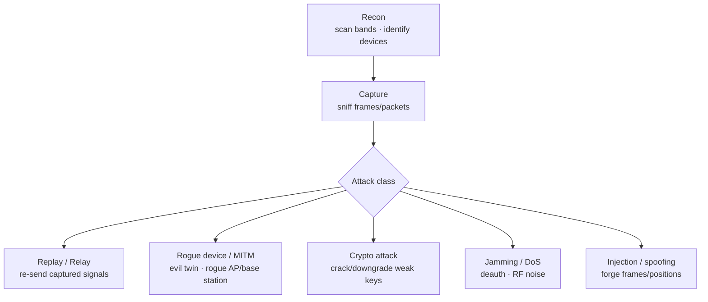

# Wireless

## Up
- [[Hacking]]

Wireless security covers attacking and defending **every radio technology** — not just Wi-Fi, but Bluetooth, RFID/NFC, IoT mesh radios, cellular, satellite navigation, and the long tail of sub-GHz remotes. They all ride the same physics (radio waves + modulation), so this category starts with the **[[RF Fundamentals]]** theory and the universal tool (**[[SDR]]**), then covers each technology's own theory, attacks, tools, and defenses.

> **⚠️ Legal notice (read first):** radio is heavily regulated. In most jurisdictions it is **illegal** to transmit on licensed/most bands without a licence, to **jam** any signal, or to **intercept** communications you're not party to. GPS spoofing, IMSI-catching, and cellular transmission are especially restricted. Do RX-only where possible, transmit only in a shielded lab or on bands you're licensed for, and test only devices you own or are authorized to assess. These notes are educational reference.

## Subtopics

**Foundations**
- [[RF Fundamentals]] — spectrum, modulation, spread spectrum, antennas, dB — the theory under everything
- [[SDR]] — Software-Defined Radio: RTL-SDR/HackRF + GNU Radio, the universal capture/replay tool

**Technologies (theory + attacks + tools)**
- [[Wi-Fi]] — 802.11, WEP/WPA/WPA2/WPA3, handshakes, evil twins
- [[Bluetooth]] — Classic BR/EDR & BLE, GATT, sniffing, KNOB/BlueBorne
- [[RFID & NFC]] — LF/HF tags, MIFARE, access cards, cloning & relay
- [[Zigbee & Z-Wave]] — 802.15.4 IoT mesh, key sniffing, replay
- [[Cellular]] — GSM/LTE/5G, IMSI catchers, downgrade attacks
- [[GPS & GNSS]] — satellite navigation, jamming & spoofing
- [[Sub-GHz & ISM]] — 315/433/868/915 MHz remotes, key fobs, garage doors

---

## The Whole Spectrum at a Glance

| Band / freq | Technology | Node |
|---|---|---|
| 125–134 kHz (LF) | Prox cards, animal chips | [[RFID & NFC]] |
| 13.56 MHz (HF) | MIFARE, NFC, transit cards | [[RFID & NFC]] |
| 315 / 433 / 868 / 915 MHz (sub-GHz ISM) | Key fobs, garage doors, remotes, weather stations | [[Sub-GHz & ISM]] |
| 800 MHz–3.8 GHz+ | GSM/LTE/5G cellular | [[Cellular]] |
| 1575.42 MHz (L1) | GPS/GNSS | [[GPS & GNSS]] |
| 2.4 GHz (ISM) | Wi-Fi, Bluetooth, Zigbee | [[Wi-Fi]] · [[Bluetooth]] · [[Zigbee & Z-Wave]] |
| 5 / 6 GHz | Wi-Fi (Wi-Fi 5/6/6E) | [[Wi-Fi]] |
| 868 (EU) / 908 (US) MHz | Z-Wave | [[Zigbee & Z-Wave]] |

The **2.4 GHz ISM band is crowded** — Wi-Fi, Bluetooth, and Zigbee all share it, which matters for both interference and attacks.

---

## Common Attack Themes (across all radios)

- **Eavesdropping** — passive capture (often legal-gray to illegal on comms).
- **Replay/Relay** — re-transmit a captured signal (unlock a car, clone a card).
- **Rogue device / MITM** — evil-twin AP, rogue cell tower, fake BLE peripheral.
- **Cryptographic** — crack weak ciphers (WEP, MIFARE Crypto1, A5/1) or **downgrade** to them (KNOB, 2G downgrade).
- **Jamming/DoS** — deny the channel (deauth on Wi-Fi, raw RF noise) — almost always illegal.
- **Injection/spoofing** — forge frames or signals (GPS spoofing, frame injection).

---

## Cross-links in the vault

- [[SDR]] is the shared capture/replay hardware for [[Sub-GHz & ISM]], [[GPS & GNSS]], [[Cellular]] research, and more.
- [[Wi-Fi]] handshakes feed [[Hashcat]]/[[Password Cracking]] (`-m 22000`).
- Attacks map to [[MITRE ATT&CK]] (e.g. *Initial Access* via rogue AP) — see [[Methodology]].
- IoT radios ([[Zigbee & Z-Wave]], [[Bluetooth]]) often bridge into [[Cloud Pentesting]] via connected hubs.
