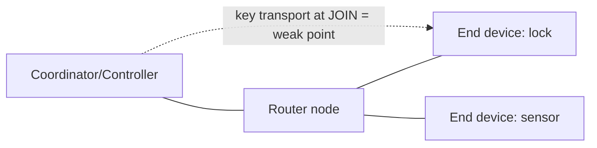

# Zigbee & Z-Wave

## Up
- [[Wireless]]

Zigbee and Z-Wave are the dominant **low-power IoT mesh** protocols — smart bulbs, locks, sensors, thermostats, alarms. Both prioritise low power and mesh range over throughput, and both have had notable key-management weaknesses. Test only your own devices/hubs.

---

## Theory — How They Work

### Zigbee (on IEEE 802.15.4)
- **Radio:** mostly **2.4 GHz** (16 channels, shares the band with [[Wi-Fi]]/[[Bluetooth]]); also 868 MHz (EU)/915 MHz (US). Built on **IEEE 802.15.4** PHY/MAC.
- **Mesh roles:** **Coordinator** (one per network, forms it), **Routers** (mains-powered, relay), **End Devices** (battery, sleepy).
- **Security:** AES-128 (CCM*) with a **Network Key** (shared) and optional **Link Keys**. The historic weak point is **key transport during joining** — early/"insecure rejoin" and a well-known **default Trust Center Link Key** (`ZigBeeAlliance09`) let attackers capture the network key.

### Z-Wave
- **Radio:** **sub-GHz** (~**868 MHz** EU / **908 MHz** US) — less congestion than 2.4 GHz, good range/penetration. Proprietary (Silicon Labs), interoperable via certification.
- **Mesh:** Controller + nodes; source-routed mesh.
- **Security:** legacy **S0** framework had a flawed key exchange (temporary key = all zeros during pairing → sniff the network key). **S2** (current) fixes this with ECDH (Curve25519) + out-of-band PIN/QR authentication.



---

## Attacks

| Attack | Zigbee | Z-Wave |
|---|---|---|
| **Key sniffing at join** | Capture the **network key** if sent with default/insecure link key | **S0** exchange uses an all-zero temp key → recover network key |
| **Replay** | Re-send captured commands (unlock, toggle) when no freshness/counter | Same, on unauthenticated/older frames |
| **Injection/spoofing** | Forge frames once key is known | Forge commands |
| **Jamming / DoS** | Flood the 2.4 GHz channel (also disrupts Wi-Fi/BT) | Jam the sub-GHz channel |
| **Downgrade** | Force insecure rejoin | Force **S0** fallback instead of S2 |
| **Rejoin/dissociation** | Kick a device off, capture its re-join key exchange | — |

The recurring theme: **capture the key exchange during pairing/join**, then you can decrypt, replay, and inject at will. Force a re-join (or wait for one) to catch it.

---

## Tools

| Tool | Role |
|---|---|
| **KillerBee** (`zbstumbler`, `zbdump`, `zbreplay`, `zbwardrive`) | The Zigbee/802.15.4 attack framework — discover, capture, replay |
| **ApiMote / Atmel RZUSBstick / TI CC2531** | 802.15.4 capture hardware for KillerBee/Wireshark |
| **Wireshark** (+ 802.15.4 dissector) | Decode Zigbee frames (supply the network key to decrypt) |
| **Z-Wave: Z-Force / EZ-Wave** | Z-Wave sniffing/attack (S0 key capture, packet injection) |
| **Scapy-radio / SDR** | Custom 802.15.4 / sub-GHz frame work ([[SDR]]) |
| **Zigbee2MQTT / zigpy (research)** | Interact with Zigbee networks (also handy for understanding) |

```text
zbstumbler                     # discover Zigbee networks/channels
zbdump -c 15 -w capture.pcap   # capture on channel 15
zbreplay -r capture.pcap       # replay captured frames (in scope!)
# open capture.pcap in Wireshark; add the network key to decrypt
```

---

## Defenses

- **Zigbee:** use unique **install codes**/link keys (not the default TC link key); disable insecure rejoin; keep the network key secret; segment IoT on its own network.
- **Z-Wave:** require **S2** (reject S0 fallback where possible); use the OOB PIN/QR authenticated pairing.
- **Application layer:** anti-replay counters and command authentication on critical devices (locks, alarms) — don't rely on the mesh key alone.
- Physically secure the **hub/coordinator**; monitor for forced dissociations and jamming; keep firmware patched.

---

## Takeaways

- Both are **AES-capable** but historically leaked keys **during joining** (Zigbee default link key; Z-Wave **S0** zero-key) — that's the attack to understand.
- **Force/observe a re-join → grab the key → decrypt/replay/inject.**
- **KillerBee** (+ ApiMote/CC2531) is the Zigbee toolkit; **S2** is the Z-Wave fix.
- 2.4 GHz Zigbee shares spectrum with [[Wi-Fi]]/[[Bluetooth]] — relevant for both jamming and interference; Z-Wave lives in the quieter sub-GHz ([[Sub-GHz & ISM]]).
